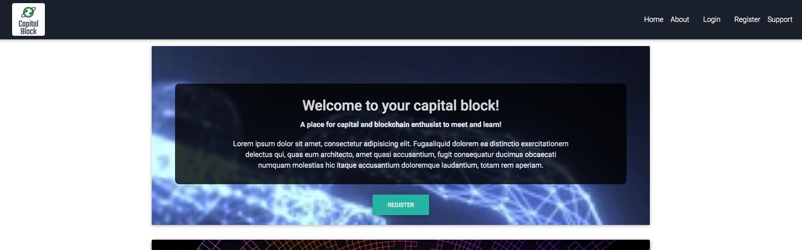
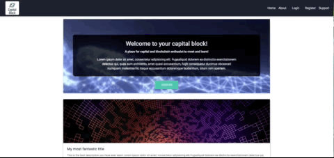
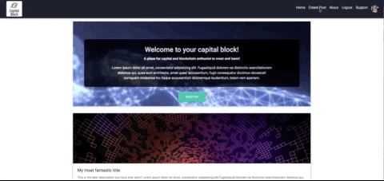
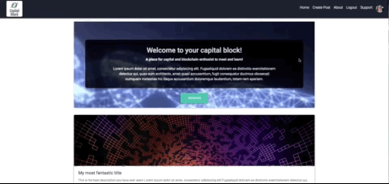
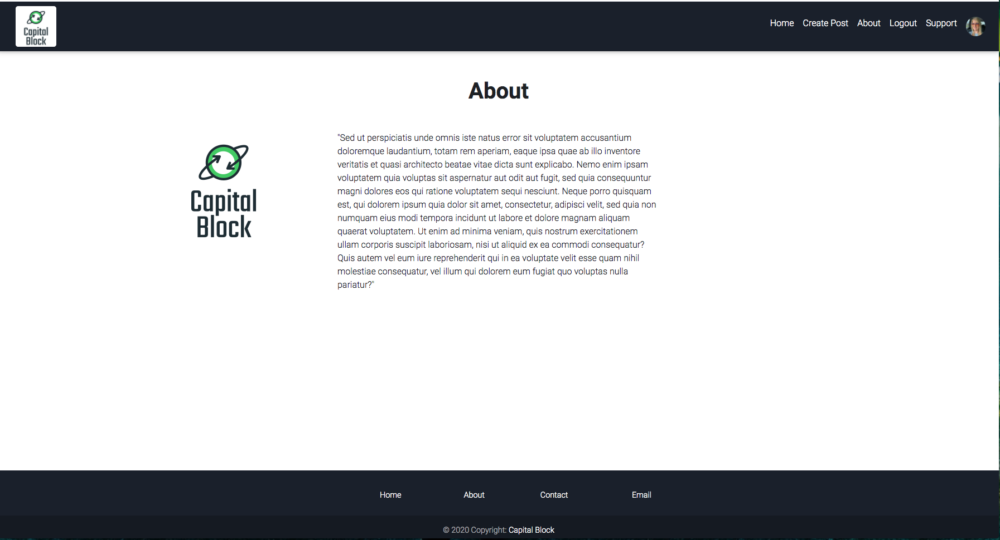
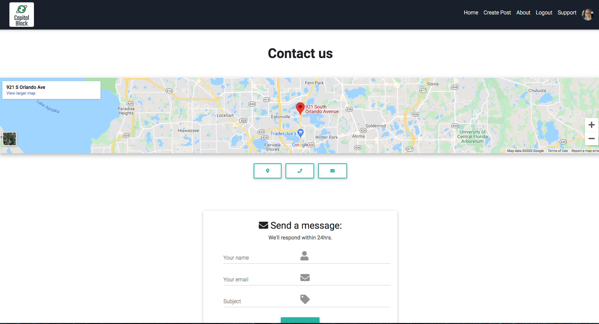

# capital-block
A place for capital and blockchain enthusiast to gather, share, and learn. 
 

 

 
 

Here is my wireframe using a new technology in beta called Uizard. What this allows you to do is make hand drawn sketches and then transform that into wireframe, then prototype, and eventually export your components into React. They are currently in beta and undergoing a massive update, according to support. I was hoping to fully demonstrate the all the features, but all component exports are disable at this time. The furthest I got with it is to the protype phase. I will build out the components from there. Keep an eye on this company. It could make wireframing, prototyping, and component builds seamless. They can be found here: https://uizard.io/ 
My prototype is here: 
https://app.uizard.io/p/SDuDpMth3 

 
 

 
 

### Required
    npm install 
 

#### Start Servers
    npm start

##### Server should be started on port 3000
 

#### Open new terminal
Then navigate to root

    cd API
    nodemon index 
 

#### Now both servers should be running on ports
    PORT 3000 (Front-end)
    PORT 9000 (Backt-end)
 
 

## Register New User

 
 

## Make a Blog Post

 
 

## Logout User

 
 

## About Page

 
 

## Contact Us

 
 

### Folder Structure 
    📦capital-block
    ┣ 📂API
    ┃ ┣ 📂.vscode
    ┃ ┃ ┗ 📜launch.json
    ┃ ┣ 📂config
    ┃ ┃ ┣ 📜config.js
    ┃ ┃ ┣ 📜database.js
    ┃ ┃ ┣ 📜express.js
    ┃ ┃ ┗ 📜routes.js
    ┃ ┣ 📂controllers
    ┃ ┃ ┣ 📜index.js
    ┃ ┃ ┣ 📜post.js
    ┃ ┃ ┗ 📜user.js
    ┃ ┣ 📂models
    ┃ ┃ ┣ 📜Post.js
    ┃ ┃ ┣ 📜TokenBlacklist.js
    ┃ ┃ ┣ 📜User.js
    ┃ ┃ ┗ 📜index.js
    ┃ ┣ 📂routes
    ┃ ┃ ┣ 📜index.js
    ┃ ┃ ┣ 📜post.js
    ┃ ┃ ┗ 📜user.js
    ┃ ┣ 📂utils
    ┃ ┃ ┣ 📜auth.js
    ┃ ┃ ┣ 📜index.js
    ┃ ┃ ┗ 📜jwt.js
    ┃ ┣ 📜.env
    ┃ ┣ 📜index.js
    ┃ ┗ 📜package-lock.json
    ┣ 📂concepts
    ┃ ┣ 📜aboutPage.jpg
    ┃ ┣ 📜blog-details.jpg
    ┃ ┣ 📜capital-block-about.png
    ┃ ┣ 📜capital-block-blog-post.gif
    ┃ ┣ 📜capital-block-home.png
    ┃ ┣ 📜capital-block-logout.gif
    ┃ ┣ 📜capital-block-register.gif
    ┃ ┣ 📜contactUsPageSketch.jpg
    ┃ ┣ 📜homepageSketch.jpg
    ┃ ┣ 📜loginPage.jpg
    ┃ ┗ 📜registerPage.jpg
    ┣ 📂node_modules
    ┣ 📂public
    ┃ ┣ 📜favicon.ico
    ┃ ┣ 📜index.html
    ┃ ┗ 📜manifest.json
    ┣ 📂src
    ┃ ┣ 📂App
    ┃ ┃ ┣ 📜App.js
    ┃ ┃ ┗ 📜App.test.js
    ┃ ┣ 📂components
    ┃ ┃ ┣ 📜About.js
    ┃ ┃ ┣ 📜BlogHome.js
    ┃ ┃ ┣ 📜BlogPost.js
    ┃ ┃ ┣ 📜Contact.js
    ┃ ┃ ┣ 📜Footer.js
    ┃ ┃ ┣ 📜Home.js
    ┃ ┃ ┣ 📜Login.js
    ┃ ┃ ┣ 📜Logout.js
    ┃ ┃ ┣ 📜Navbar.js
    ┃ ┃ ┣ 📜Post.js
    ┃ ┃ ┗ 📜Register.js
    ┃ ┣ 📂img
    ┃ ┃ ┣ 📜avatar.jpeg
    ┃ ┃ ┗ 📜capital-block-final-logo.png
    ┃ ┣ 📂routes
    ┃ ┃ ┣ 📜AboutRoute.js
    ┃ ┃ ┣ 📜ContactRoute.js
    ┃ ┃ ┣ 📜HomeRoute.js
    ┃ ┃ ┣ 📜LoginRoute.js
    ┃ ┃ ┣ 📜LogoutRoute.js
    ┃ ┃ ┣ 📜PostRoute.js
    ┃ ┃ ┣ 📜RegisterRoute.js
    ┃ ┃ ┣ 📜SupportRoute.js
    ┃ ┃ ┗ 📜index.js
    ┃ ┣ 📂services
    ┃ ┃ ┗ 📜getPosts.js
    ┃ ┣ 📂utils
    ┃ ┃ ┣ 📜API.js
    ┃ ┃ ┗ 📜History.js
    ┃ ┣ 📜index.css
    ┃ ┣ 📜index.js
    ┃ ┣ 📜logo.png
    ┃ ┗ 📜registerServiceWorker.js
    ┣ 📜.gitignore
    ┣ 📜LICENSE
    ┣ 📜README.md
    ┣ 📜package-lock.json
    ┣ 📜package.json
    ┗ 📜yarn.lock

### Potential external API's 

Plaid- for linking app with bank accounts 
https://dashboard.plaid.com/overview/sandbox 

CryptoCompare- for cyrpto market data. 
https://www.cryptocompare.com/cryptopian/api-keys 

Abstract- Phone Verification, Location Verification, Email Verification
https://app.abstractapi.com/ 

### TODO
- [ ] About link in navbar.
- [ ] make call to get user name in navbar.
- [ ] make profile page
- [ ] reverse order of homeblog/homepost rendering.
- [ ] make front end validation on register and login inputs.
- [ ] crypto ticker.
- [ ] Make Message Schema and routes to save messages to DB from contact us page.
- [ ] Post details page.
- [ ] 404 page.
- [ ] Heroku Depoloyment.
- [ ] Complete README.md.